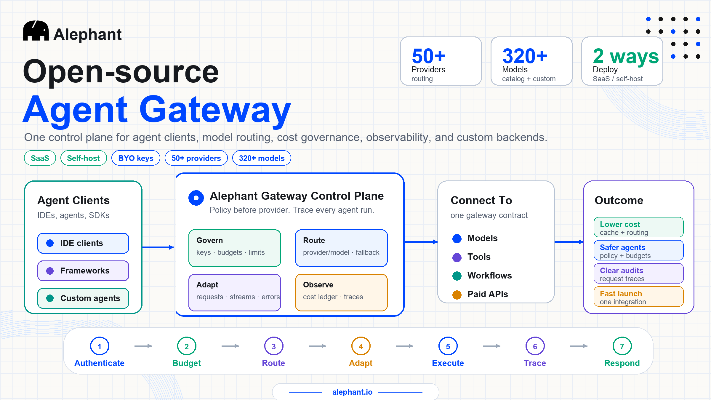
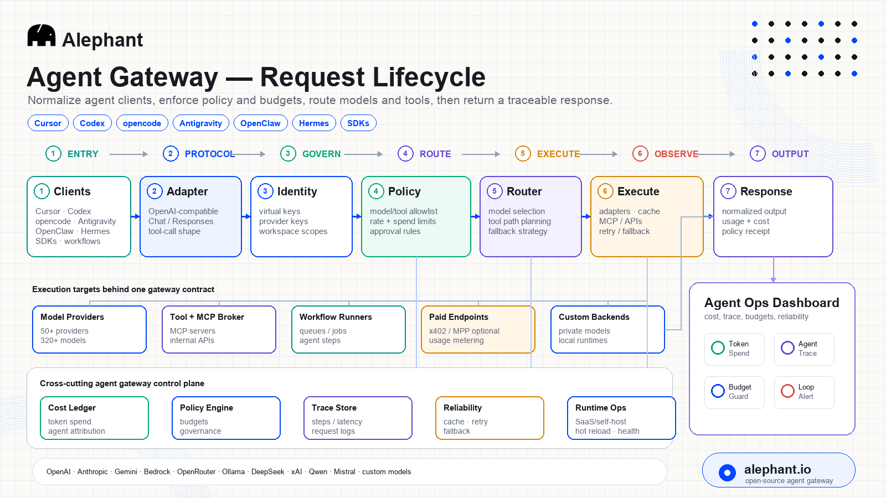
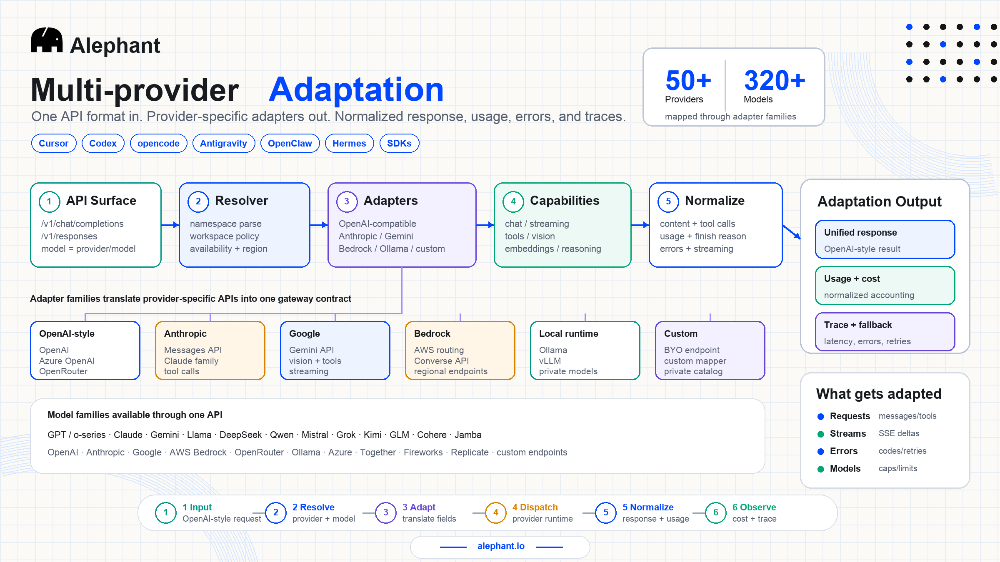
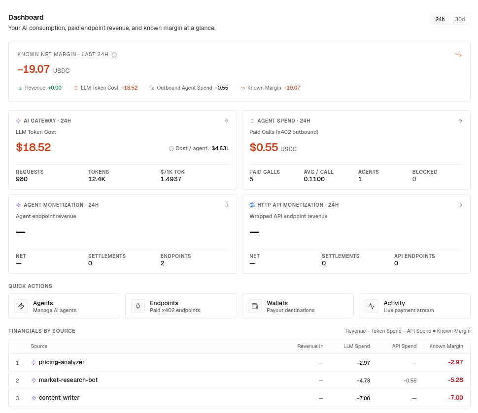

<h1 align="center">
  
  Alephant AI Gateway
</h1>

<p align="center">
  <strong>Open-source Agent Gateway for AI agents and workflows.</strong><br />
  Alephant provides an OpenAI-compatible gateway for 50+ providers, 320+ models, and custom model backends. It routes traffic, adapts provider APIs, caches responses, enforces policy, and observes every request from one developer-friendly integration point.
  
  Beyond standard AI Gateway routing, Alephant is built for agents: agent identity, runtime policies, budget guardrails, session tracing, token and API spend control, paid endpoints, and per-call margin visibility.

</p>

<p align="center">
  <a href="LICENSE"></a>
  
  
  
  
  
</p>

<p align="center">
  <a href="https://x.com/alephantai" rel="noopener noreferrer" target="_blank"></a>
  <a href="https://discord.gg/tRQghcXhaH" rel="noopener noreferrer" target="_blank"></a>
  <a href="https://t.me/alephantai" rel="noopener noreferrer" target="_blank"></a>
</p>

<p align="center">
  
  
  
  
</p>

<p align="center">
  
</p>

<p align="center">
  <a href="#quickstart">Quickstart</a> ·
  <a href="https://alephant.io/">Website</a> ·
  <a href="#features">Features</a> ·
  <a href="#ide-integration">IDE</a> ·
  <a href="#architecture">Architecture</a> ·
  <a href="#screenshots">Screenshots</a> ·
  <a href="#comparison">Comparison</a> ·
  <a href="#community">Community</a> ·
  <a href="https://developers.alephant.io/">Docs</a>
</p>

<p align="center">
  <a href="https://alephant.io/"><b>Get started -></b></a> ·
  <a href="README.zh-CN.md">Simplified Chinese</a>
</p>

## What is Alephant Agent Gateway

Alephant Agent Gateway is an open-source gateway for AI agents, coding agents, and LLM-powered workflows.

It provides an OpenAI-compatible gateway for 50+ providers, 320+ models, and custom model backends. It routes traffic, adapts provider APIs, caches responses, enforces policy, and observes every request from one developer-friendly integration point.

Unlike a standard AI Gateway, Alephant is designed around agents as first-class runtime actors. Each agent can have its own identity, virtual keys, model access, budget limits, runtime policies, sessions, request traces, and financial ledger.

Alephant helps teams control token and API spend, prevent runaway agent behavior, and turn agents or workflows into paid endpoints with clear revenue, cost, and margin tracking.

```typescript
import OpenAI from "openai"

const openai = new OpenAI({
  baseURL: "https://ai.alephant.io/v1",
  defaultHeaders: {
    Authorization: `Bearer ${process.env.ALEPHANT_API_KEY}`,
    "Alephant-Session-Id": "session-xxx", // optional
  }
})
```

## Project status

Alephant Agent Gateway is currently in beta (`0.2.0-beta.30`). Alephant Cloud is the hosted SaaS path, and this repository provides the gateway runtime for self-hosted and platform-connected deployments. Public APIs, configuration fields, and internal build modes may evolve before a stable `1.0` release.

---

## Why this exists

AI agents are not simple model calls.

They run multi-step sessions, call tools, retry failed steps, loop unexpectedly, use different models, trigger APIs, and sometimes expose capabilities as paid services. A standard AI Gateway can route requests and collect logs, but it usually does not understand the agent as the operating unit.

Alephant exists to make agents governable.

Every agent needs an identity, a budget, runtime policies, request traces, and a clear financial record. Teams should know which agent created the spend, which session caused the spike, which model or tool was used, and whether a paid agent call was profitable.

Alephant provides the gateway layer for that agent lifecycle: route the model call, enforce policy, track cost, observe the session, control spend, and connect revenue back to the agent that generated it. [Learn more ->](https://alephant.io/)

<a id="features"></a>

## Features

| Capability | What Alephant Agent Gateway provides |
| --- | --- |
| Agent-first gateway | A gateway designed for AI agents, coding agents, and LLM-powered workflows, not just single LLM requests |
| One API surface | OpenAI-compatible `/v1/*` and `/ai/*` routes for chat, responses, embeddings, images, and provider-style model names |
| Provider and model coverage | 50+ providers, 320+ models, local runtimes, OpenRouter-style catalogs, and custom/private model backends |
| Provider adaptation | Request, tool, streaming, error, usage, finish-reason, and response normalization across provider APIs |
| Agent client compatibility | OpenAI-compatible formats for Cursor, Codex, opencode, Antigravity, OpenClaw, Hermes, and custom agent clients |
| IDE and coding-agent integration | Cursor, opencode, Codex, and agent workflow-ready with client adapters, workflow guides, implementation skills, and task management; Claude Code adapter in progress |
| Agent identity | Attribute requests to workspace, project, agent, user/member, virtual key, session, prompt, model, and provider |
| Runtime policies | Configure per-agent limits for model access, retries, tokens, session cost, timeouts, fallback behavior, and kill-switch controls |
| Budget guardrails | Enforce hard-dollar spend policies across workspace, project, agent, member, session, model, provider, and endpoint dimensions |
| Policy-aware routing | Route by agent identity, model policy, budget state, latency target, provider health, cost preference, and fallback strategy |
| Routing and resilience | Direct provider paths, policy routers, retries, fallback, health checks, provider 429 handling, and fail-open cache paths |
| Policy and key control | Virtual keys, master key resolution, model policy, workspace provider allowlists, endpoint policies, and concurrency controls |
| Caching | Gateway-side LLM KV cache and semantic cache to avoid repeated upstream calls and reduce token spend |
| Agent observability | Request logs, session traces, model usage, latency, errors, token spend, policy decisions, and optional body archival |
| Cost attribution | Track token cost by agent, workflow, user, session, request, prompt, model, provider, and virtual key |
| Paid endpoints | Turn agents, workflows, and HTTP services into paid endpoints with payment verification, request forwarding, and revenue tracking |
| Agent ledger | Connect buyer revenue, AI token cost, external API spend, fees, policy decisions, and known margin per paid call |
| Live operations | Route, virtual key, provider key, policy, and endpoint refresh from database changes without restarting the gateway |
| Deployment | Hosted SaaS through Alephant Cloud, or self-hosted Rust gateway with PostgreSQL, Redis, Qdrant, and S3-compatible integrations |

## Developer surface

| Surface | Purpose |
| --- | --- |
| `/v1/*` | Drop-in OpenAI-compatible API for existing SDKs and agent clients |
| `/router/{id}/*` | Policy-driven routing through a configured router |
| `/{provider}/*` | Direct provider passthrough when you want explicit upstream control |
| `model=provider/model_id` | Select a provider and model without changing application code |
| Custom backends | Put private models or self-hosted runtimes behind the same gateway contract |

<h2 id="architecture">Architecture & request lifecycle</h2>

<p align="center">
  
</p>

Every request passes through the same gateway lifecycle: global middleware, routing, provider mapping, dispatch, cache, fallback, and async logging. The entry path depends on how much control you want:

| Path | Use it for |
| --- | --- |
| `/v1/*` | Unified OpenAI-style access with `model=provider/model_id` |
| `/router/{id}/*` | Policy-driven routing through a configured router |
| `/{provider}/*` | Direct provider passthrough when you want an explicit upstream |

## Multi-provider adaptation

Use one OpenAI-style request shape across 50+ providers and 320+ models, including OpenAI-compatible APIs, Anthropic Messages, Gemini, Bedrock, Ollama, OpenRouter-style catalogs, and custom backends. The client selects a runtime with `model=provider/model_id`; Alephant resolves the provider, applies the right adapter, maps provider-specific fields, and returns a normalized OpenAI-style response.

Instead of listing every model in the README, this section focuses on the contract: one request format in, one consistent response out. The provider and model catalog can evolve independently without forcing application code changes.

<p align="center">
  
</p>

<blockquote>
  <table>
    <tr>
      <td><strong>Mainstream models</strong></td>
      <td>GPT-4o · GPT-4.1 · o3 · Claude 3.5/3.7 Sonnet · Claude Opus · Gemini 1.5/2.0 · Llama 3/4 · Mistral Large · Command R+</td>
    </tr>
    <tr>
      <td><strong>Provider ecosystem</strong></td>
      <td>OpenAI · Anthropic · Google Gemini · AWS Bedrock · Azure OpenAI · OpenRouter · Together AI · Fireworks · Groq · Cohere · Mistral · Perplexity · DeepSeek · xAI · Ollama</td>
    </tr>
    <tr>
      <td><strong>Agent client compatibility</strong></td>
      <td>Cursor · Codex · opencode · Antigravity</td>
    </tr>
  </table>
</blockquote>

<a id="ide-integration"></a>

## IDE integration

Alephant AI Gateway ships repository-level tooling for AI-assisted development inside supported IDEs.

| IDE / Agent Client | Status | What's included |
| --- | --- | --- |
| Cursor | Ready | Project architecture & code-convention rules, development & API workflow guides, gated-module-implementation skill (Skill), file-based task management (Task Magic) — see the `.cursor` directory; also configure the gateway in Agent Settings → Models |
| opencode | Ready | OpenAI-compatible agent client adaptation and gateway configuration support |
| Codex | Ready | Codex CLI / VS Code client detection, Responses API adaptation, and gateway configuration support |
| Claude Code | In progress | Adapter and configuration under development |

<a id="quickstart"></a>

## Quickstart

### Use Alephant Cloud (hosted SaaS)

Keep your existing OpenAI SDK and change only the base URL plus authorization header. Your app keeps using familiar OpenAI-style calls while Alephant Cloud gives you the managed workspace, hosted gateway endpoint, provider resolution, routing, caching, logging, and fallback.

Set your gateway key:

```bash
export ALEPHANT_API_KEY="vk-..."
```

Smoke-test with `curl`:

```bash
curl https://ai.alephant.io/v1/chat/completions \
  -H "Authorization: Bearer $ALEPHANT_API_KEY" \
  -H "Content-Type: application/json" \
  -d '{
    "model": "openai/gpt-4o",
    "messages": [
      { "role": "user", "content": "Explain Alephant AI Gateway in one sentence." }
    ]
  }'
```

Or use the OpenAI SDK:

```typescript
import OpenAI from "openai"

const openai = new OpenAI({
  baseURL: "https://ai.alephant.io/v1",
  defaultHeaders: {
    Authorization: `Bearer ${process.env.ALEPHANT_API_KEY}`,
    "Alephant-Session-Id": "demo-session", // optional: group requests into a trace/session
  }
})

const response = await openai.chat.completions.create({
  model: "openai/gpt-4o",
  messages: [
    { role: "user", content: "Explain Alephant AI Gateway in one sentence." }
  ]
})

console.log(response.choices[0]?.message?.content)
```

[Get started ->](https://alephant.io/)

## Self-host from source

Alephant AI Gateway can run as an independent self-hosted Rust service. You can point your own applications at the local gateway, connect it to your own PostgreSQL/Redis/Qdrant/S3-compatible infrastructure, and control provider keys, router configuration, cache behavior, and logging destinations from your deployment.

Self-hosting is useful when you need the gateway inside your own network, want full control over upstream provider credentials, or need to test provider adaptation and routing behavior before connecting to Alephant Cloud.

### Prerequisites

| Dependency | Required | Used for |
| --- | --- | --- |
| Rust toolchain | Yes | Build and run the gateway service |
| PostgreSQL | Yes | Router, key, workspace, and runtime configuration |
| Redis | Recommended | Shared runtime state, concurrency controls, and cache-related paths |
| Qdrant | Optional | Semantic cache |
| S3-compatible storage | Optional | Large request/response body archival |

Build `ai-gateway` with exactly one of `--features external` or `--features internal`.

### Build

```bash
cargo build -p ai-gateway --features external
```

Use `external` for the public/open deployment mode, or `internal` when running with the internal KV/backend assumptions used by your environment. Only enable one of these feature sets at a time.

### Run locally

```bash
cargo run -p ai-gateway --features external -- -c ./ai-gateway/config/local.yaml
```

The config file controls database connections, provider settings, cache services, observability, and runtime behavior. For local development, start with `ai-gateway/config/local.yaml` and adjust it to match your services.

### Configuration

The gateway reads a YAML config file and supports environment overrides for sensitive values. Keep secrets such as provider keys, S3 credentials, and Redis URLs out of committed YAML whenever possible.

Useful starting points:

| File | Purpose |
| --- | --- |
| `ai-gateway/config/local.yaml` | Local development defaults |
| `ai-gateway/config/local-cloud.yaml` | Local cloud-style integration |
| `ai-gateway/config/alephant-cloud.yaml` | Alephant platform-connected deployment shape |

Environment overrides follow the `AI_GATEWAY__...` pattern used by the config loader, for example `AI_GATEWAY__S3__ACCESS_KEY`, `AI_GATEWAY__S3__SECRET_KEY`, and `AI_GATEWAY__REQUEST_LOG__LOG_QUEUE_REDIS_URL`.

### Verify

Keep the local gateway process running. The smoke harness targets the default local gateway URL, `http://localhost:8080`.

```bash
cargo run -p test
```

You can also point an OpenAI-compatible SDK at your self-hosted gateway:

```typescript
import OpenAI from "openai"

const openai = new OpenAI({
  baseURL: "http://localhost:8080/v1",
  defaultHeaders: {
    Authorization: `Bearer ${process.env.ALEPHANT_VIRTUAL_KEY}`,
  }
})
```

### Integration tests

```bash
cargo test -p ai-gateway --tests --features "external integration"
```

## Security & privacy

Alephant AI Gateway is designed for both managed SaaS usage and self-hosted deployments where teams need control over provider credentials, request metadata, and deployment boundaries.

| Area | Gateway behavior |
| --- | --- |
| BYO provider keys | Provider credentials can stay under your control through gateway configuration and key resolution |
| Virtual key isolation | Application-facing keys can be separated from upstream provider keys |
| Optional body archival | Request/response body storage is configurable rather than mandatory |
| SaaS or self-host | Use Alephant Cloud for managed operations, or run the gateway inside your own infrastructure |
| Policy gates | Model policy, provider allowlists, and concurrency controls can be enforced before upstream dispatch |

## Runtime internals

| Capability | Why it matters |
| --- | --- |
| DB listener-driven hot reload | Route and key changes can be picked up without restarting the gateway |
| S3-compatible body storage | Request and response bodies can be archived outside the hot request path when enabled |
| Downstream request-log delivery | Structured gateway logs can be pushed to Alephant or another downstream system |
| Content-filter integration | Optional gRPC filter path with fail-open reconnect behavior |
| Workspace concurrency guard | Redis-backed controls help protect shared upstream capacity |
| Provider 429 monitoring | Provider rate-limit signals can feed discovery and routing decisions |

## Screenshots

Explore the Alephant workspace experience around the gateway: usage overview, request logs, sessions, cache visibility, insights, and governance controls.

| Overview | Request logs |
| --- | --- |
| <br /><sub>Workspace-level usage, request volume, latency, tokens, and cache health.</sub> | <br /><sub>Request-level inspection for status, model, source, tokens, cost, and upstream outcome.</sub> |

| Sessions | Cache |
| --- | --- |
| <br /><sub>Trace agent and application journeys across steps, duration, spend, and status.</sub> | <br /><sub>Monitor cache hits, savings, repeated prompts, and frequently reused responses.</sub> |

| Insights | Governance |
| --- | --- |
| <br /><sub>Surface reliability, spend, and efficiency signals from gateway traffic.</sub> | <br /><sub>Configure usage limits, budget controls, rate limits, and policy rules.</sub> |

<a id="comparison"></a>

## Comparison

Portkey, Helicone, LiteLLM, and Alephant are all useful infrastructure projects, but they start from different centers of gravity.

Portkey is gateway and enterprise guardrails-first. Helicone is observability-first. LiteLLM is provider proxy and SDK-first. Alephant is agent-first: it is built for teams running AI agents, coding agents, and LLM-powered workflows that need identity, runtime control, cost guardrails, paid endpoints, and per-call margin visibility.

| Project | Best known for | Best fit |
| --- | --- | --- |
| Portkey | AI gateway, guardrails, observability, governance, prompt management, and enterprise control workflows | Teams that want a managed AI control plane for LLM traffic and policy enforcement |
| Helicone | LLM observability, request analytics, sessions, traces, and cost visibility | Teams whose primary need is logging, analytics, debugging, and usage visibility |
| LiteLLM | Broad OpenAI-compatible proxy, Python SDK, provider abstraction, virtual keys, and spend controls | Teams that want maximum provider coverage and a flexible proxy/SDK stack |
| Alephant Agent Gateway | Agent identity, runtime policies, token/API spend control, paid endpoints, and agent margin ledger | Teams building production agents and workflows that need cost guardrails, request traceability, BYO keys, monetization, and per-call margin tracking |

| Capability | Portkey | Helicone | LiteLLM | Alephant Agent Gateway |
| --- | --- | --- | --- | --- |
| OpenAI-compatible API | Yes | Yes | Yes | Yes |
| SaaS + self-host path | Enterprise and self-host options | Hosted and self-host options | Self-hosted proxy, hosted options vary | Alephant Cloud plus self-hosted Rust gateway |
| Provider/model coverage | Broad | Broad observability/proxy coverage | Very broad provider abstraction | 50+ providers, 320+ models, local runtimes, and custom backends |
| Provider adaptation | Gateway configs, routing, retries, guardrails | Proxy and observability pipeline | Strong provider abstraction | Explicit normalization for requests, tools, streaming, errors, usage, finish reasons, and responses |
| Routing and resilience | Routing, retries, fallbacks, load balancing, circuit breakers | Request forwarding and observability-focused workflows | Router, fallback, budgets, rate limits | Direct paths, policy routers, fallback, health checks, provider 429 handling, and fail-open cache paths |
| Caching | Simple and semantic caching | Cache visibility/integrations | Cache integrations | LLM KV cache plus semantic cache |
| Observability | Logs, policy events, traces, metrics | Core strength: request logs, sessions, analytics, costs | Callback/logging integrations | Requests, sessions, traces, metrics, usage metadata, cost, policy decisions, and optional body archival |
| Key and access control | Key vault, configs, access controls | Proxy keys and request controls | Virtual keys, teams, budgets, self-hosted keys | Virtual keys, BYO provider keys, master-key resolution, workspace allowlists, model policy, and endpoint policy |
| Budget and spend controls | Budget limits and gateway guardrails | Cost visibility and analytics | Budgets and spend controls | Agent/session-aware budget guardrails across workspace, project, agent, member, model, provider, and endpoint |
| Agent identity | Supports agent framework integrations | Can trace sessions and users | Can be used by agent clients | First-class agent registry: workspace, project, agent, user, session, prompt, model, provider, and virtual key attribution |
| Runtime agent policies | General gateway policy and guardrails | Primarily observability-driven | Budgets, keys, routing, rate limits | Per-agent model access, token limits, retries, session budgets, fallback behavior, timeout controls, and kill-switch rules |
| Agent client compatibility | General SDK/proxy compatibility | General SDK/proxy compatibility | General OpenAI-compatible compatibility | Cursor, Codex, opencode, Antigravity, OpenClaw, Hermes, LangChain, LlamaIndex, and custom OpenAI-compatible agents |
| Agent workflow support | Can support agent traffic through gateway patterns | Strong tracing for agent/session workflows | Works well as a proxy for agent frameworks | Built for agents, coding agents, n8n workflows, Activepieces, Zapier, Pipedream, Make, and custom workflow endpoints |
| Paid endpoints | Not the primary product center | Not the primary product center | Not the primary product center | Turn agents, workflows, and HTTP services into paid endpoints |
| Agent ledger and margin | Not the primary product center | Cost visibility, not revenue/cost margin ledger | Spend tracking, not paid-agent margin ledger | Tracks buyer revenue, AI token cost, external API spend, fees, policy decisions, and known margin per paid call |

Alephant's differentiator is not only provider routing. It is the combination of an OpenAI-compatible gateway, agent identity, runtime control, budget guardrails, BYO-key governance, paid endpoints, and an agent ledger that connects revenue, token cost, external API spend, and known margin.

```text
Standard AI gateways route model calls.
Alephant governs agents at runtime and tracks the margin of every paid call.

## Repository structure

```text
alephant-ai-gateway/
├── ai-gateway/                 # Gateway service crate
├── crates/                     # Shared libraries and harnesses
├── docs/                       # In-repo notes; curated docs at https://api.alephant.io/
├── scripts/                    # CI and local automation
├── infrastructure/             # Deployment and observability infra
├── test/                       # Integration and runtime test helpers
├── AGENTS.md                   # Agent collaboration conventions
├── CLAUDE.md                   # Command and architecture reference
└── CHANGELOG.md                # Project changelog
```

<a id="community"></a>

## Community

- Website: [alephant.io](https://alephant.io/)
- Docs: [developers.alephant.io](https://developers.alephant.io/)
- Discord: [discord.gg/tRQghcXhaH](https://discord.gg/tRQghcXhaH)
- Telegram: [t.me/alephantai](https://t.me/alephantai)
- X: [x.com/alephantai](https://x.com/alephantai)

## Contributing

Contributions are welcome through issues and pull requests.

Helpful contribution areas:

- Provider adapter correctness and API mapping.
- Routing, fallback, and resilience behavior.
- Observability and diagnostics quality.
- Test harness coverage and documentation clarity.

For substantial changes, include reproducible validation steps and feature-flag context (`external` or `internal`).

## License

Licensed under the [GPL License 3.0](LICENSE).
Upstream license continuity is preserved where applicable.

## Star History

<a href="https://www.star-history.com/?repos=AlephantAI%2FAIephant-AI-Gateway&type=date&legend=top-left">
 <picture>
   <source media="(prefers-color-scheme: dark)" srcset="https://api.star-history.com/chart?repos=AlephantAI/AIephant-AI-Gateway&type=date&theme=dark&legend=top-left" />
   <source media="(prefers-color-scheme: light)" srcset="https://api.star-history.com/chart?repos=AlephantAI/AIephant-AI-Gateway&type=date&legend=top-left" />
   
 </picture>
</a>
